# ITC Stock Management System — Phase 2: System Design (Mermaid‑Safe, With Simple Explanations)

**Tech:** Laravel 12 + Filament · MySQL · Spatie Roles + Policies  
**UI:** Single Filament Admin Panel  
**Anchors:** Branch scoped · Stock Ledger as truth · No Negative Stock · Pay Before Deliver

> Mermaid‑safe version: all flowchart node labels use plain ASCII (no colons, slashes, emojis, or special symbols) so GitHub renders correctly.  
> Each flow includes a diagram **and** your simple explanation style (Steps + Example).

---

## 1) Inputs (from Phase 1)
- Roles: Super Admin, Admin (Branch Manager), Distributor  
- Modules: Branches, Users/Roles, Distributors, Products/Categories, Purchases (IN), Orders (OUT), Transfers, Stock Counts, Adjustments/Returns, Stock Ledger, Reports, Settings, Audit Log  
- Rules: Branch scoped access, No Negative Stock, Pay Before Deliver, Ledger append only  
- Location Master: Provinces, Districts

---

## 2) Entity List (Tables)
- provinces, districts, branches, users (+ Spatie tables)  
- product_categories, products, product_images  
- distributors, suppliers  
- purchase_orders, purchase_items  
- sales_orders, order_items  
- payments  
- transfers, transfer_items  
- stock_counts, stock_count_items  
- stock_adjustments  
- stock_ledger (append only)  
- stock_levels (fast cache)  
- audit_logs, settings

---

## 3) ERD (Entity Relationship Diagram)
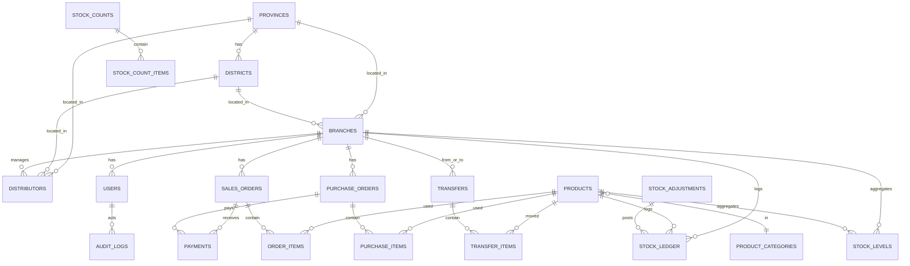
**In simple:** Branches own users, orders, transfers, and stock. Products link to order lines and stock. Ledger logs **every** movement; Stock Levels store the **current** balance per branch × product.

---

## 4) Table Sketches (key fields)
- products: id, sku, name, category_id, unit, base_price, min_stock, is_active  
- sales_orders: id, branch_id, distributor_id, so_no, status, totals, confirmed_at, fulfilled_at  
- order_items: id, sales_order_id, product_id, qty, unit_price, line_total  
- stock_ledger: id, branch_id, product_id, ref_type, ref_id, qty_in, qty_out, unit_cost, occurred_at  
- stock_levels: PK(branch_id, product_id), qty_current

---

## 5) Invariants and Policies
- No Negative Stock: check stock_levels before any OUT movement.  
- Pay Before Deliver: block delivery if not fully paid.  
- Ledger Immutable: insert only; corrections via adjustments.  
- Transfers Double Entry: OUT at source branch, IN at target branch.

---

## 6) Core Flows (15 Mermaid‑safe diagrams with your simple explanations)

### 1) Purchasing (IN)
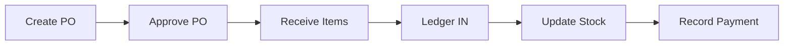
👉 When company buys from supplier.  
**Steps:** Create PO → Approve → Receive → Ledger IN → Stock increases → Payment recorded.  
**Example:** HQ orders 1,000 Shampoo from Unilever → receives them → stock at HQ goes up by 1,000.

---

### 2) Sales (OUT, Pay Before Deliver)
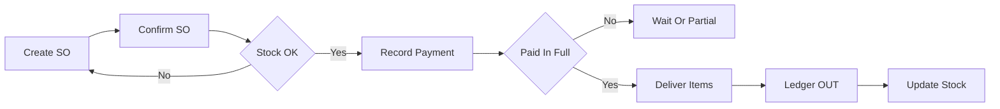
👉 When branch sells to distributor.  
**Steps:** Create SO → Confirm → Check stock → Payment → If fully paid → Deliver → Ledger OUT → Stock decreases.  
**Example:** Lucky Mart orders 50 Shampoo from Phnom Penh branch. They pay, branch delivers, stock decreases by 50.

---

### 3) Transfers (HQ ↔ Branch)
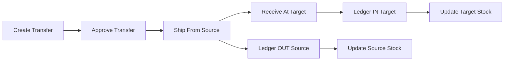
👉 Move stock between locations.  
**Steps:** Create Transfer → Approve → Ship → Ledger OUT at source → Receive → Ledger IN at target.  
**Example:** HQ ships 200 Shampoo to Siem Reap branch. HQ stock goes down 200, Siem Reap stock goes up 200.

---

### 4) Stock Count (Variance)
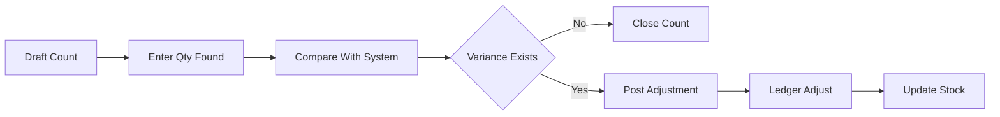
👉 Check physical stock vs system stock.  
**Steps:** Draft count → Count items → Compare → If mismatch → Post adjustment → Update ledger.  
**Example:** System says 100 Cream, but staff counts 95 → -5 adjustment added to ledger.

---

### 5) Stock Adjustment (Manual)
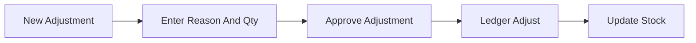
👉 Fix errors, damages, or corrections.  
**Steps:** Create adjustment → Add reason + qty → Approve → Ledger updates stock.  
**Example:** 3 Shampoo bottles are damaged → Adjustment OUT -3 → Stock reduced by 3.

---

### 6) Payments (Partial Or Full)
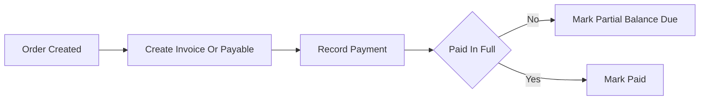
👉 Record money paid by distributor or paid to supplier.  
**Steps:** Order created → Payment recorded → If partial, mark balance due → If full, mark paid.  
**Example:** Lucky Mart’s order is $1,000. They first pay $600 (partial). Later pay $400 → marked paid.

---

### 7) Invoice Or Receipt Printing
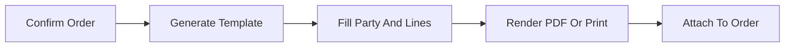
👉 Generate invoice/receipt for orders.  
**Steps:** Confirm order → Generate invoice template → Fill details → Print/Export PDF → Attach to order.  
**Example:** Distributor buys 50 Shampoo. System generates invoice showing items, price, totals, and payment.

---

### 8) User And Role Management
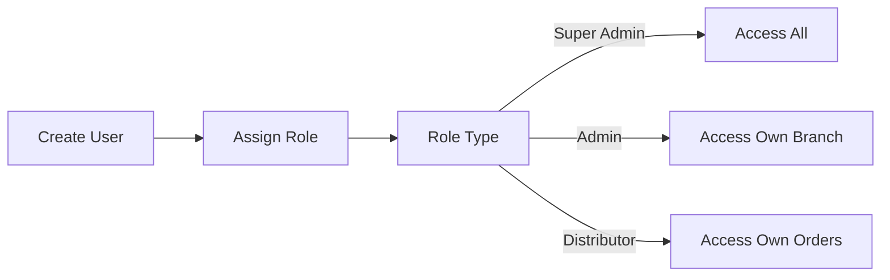
👉 Who can log in and what they can do.  
**Steps:** Super Admin creates user → Assigns role (HQ/Admin/Distributor).  
**Example:** Super Admin adds Admin for Battambang branch → That Admin sees only Battambang data.

---

### 9) Branch Scoping Enforcement
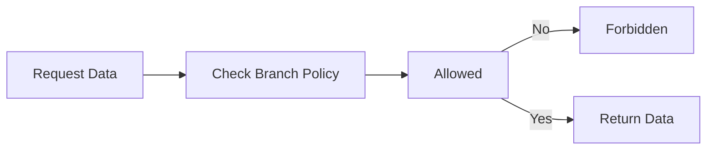
👉 Admins only see their branch data.  
**Steps:** Every request checks branch_id → If not allowed, deny access.  
**Example:** Phnom Penh Admin tries to view Siem Reap stock → blocked.

---

### 10) Audit Logging
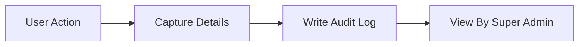
👉 Track who did what in the system.  
**Steps:** User action → Capture before/after → Save audit log.  
**Example:** Admin changes distributor phone number → Old and new values saved in audit log.

---

### 11) Settings Management
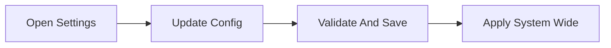
👉 Global system settings.  
**Steps:** Open settings → Update currency, tax, invoice prefix → Save → Apply system‑wide.  
**Example:** Change invoice number prefix from “INV-” to “ITC-” → New invoices start with ITC-.

---

### 12) Dashboards (KPIs)
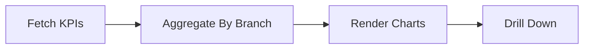
👉 Quick summary at a glance.  
**Example cards:** Inventory Value, Top Sellers, Low Stock, Order Fulfillment %.  
**Example:** Dashboard shows: Stock Value = $100k, Top Seller = Shampoo, Low Stock = 3 items.

---

### 13) Reports
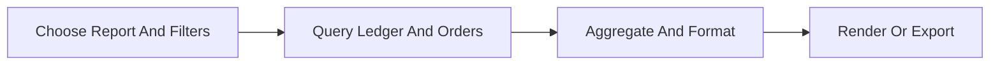
👉 Detailed data with filters and exports.  
**Steps:** Select report → Query data → Show table or export.  
**Example:** Sales report for August: Shampoo 1,000 pcs, Cream 500 pcs. Exported to CSV.

---

### 14) Purchase Returns (to Supplier)
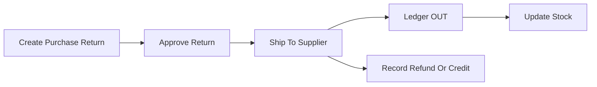
👉 Send stock back to supplier.  
**Steps:** Create purchase return → Approve → Ship → Ledger OUT → Stock decreases.  
**Example:** 20 damaged Shampoo returned to Unilever → HQ stock goes down 20.

---

### 15) Sales Returns (Distributor → Branch)
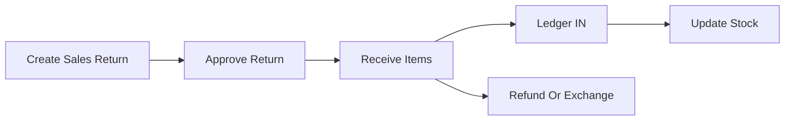
👉 Distributor returns stock to branch.  
**Steps:** Create sales return → Approve → Receive → Ledger IN → Stock increases.  
**Example:** Lucky Mart returns 5 expired Shampoo → Phnom Penh branch stock goes up by 5.

---

## 7) Sequence: Pay Before Deliver
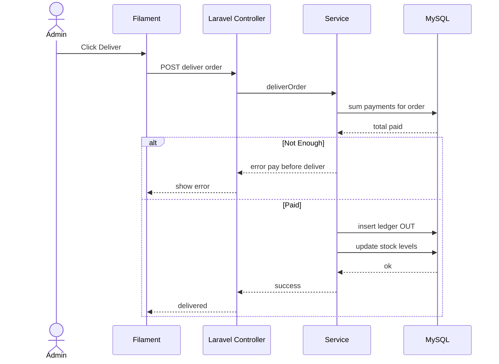

---

## 8) Migration Plan (order)
1. provinces, districts  
2. branches, users (+Spatie)  
3. product_categories, products  
4. distributors, suppliers  
5. purchase_orders, purchase_items  
6. sales_orders, order_items  
7. transfers, transfer_items  
8. stock_counts, stock_count_items  
9. stock_adjustments  
10. payments  
11. stock_ledger, stock_levels  
12. audit_logs, settings

---

## 9) Filament Resource Plan
- Branch (CRUD)  
- Product Category (CRUD)  
- Product (CRUD)  
- Distributor (CRUD)  
- Supplier (CRUD)  
- Purchase Order (Approve, Receive)  
- Sales Order (Confirm, Deliver)  
- Transfer (Approve, Ship, Receive)  
- Stock Count (Post Variance)  
- Stock Adjustment (Approve)  
- Stock Ledger (read only)  
- Stock Levels (read only)  
- Payments (linked to orders)  
- Audit Log (read only)

---

## 10) Exit Checklist
- [x] ERD diagram  
- [x] Table sketches  
- [x] Policies enforced  
- [x] All 15 flows with explanations  
- [x] Migration order  
- [x] Filament resources
