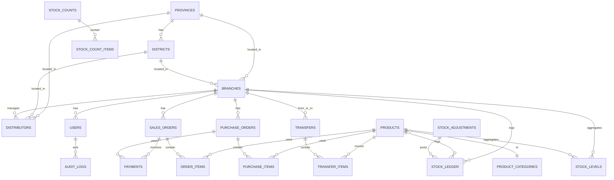
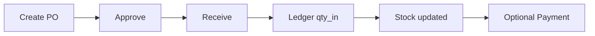
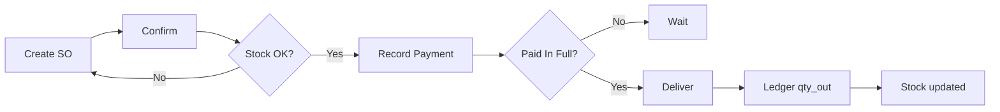
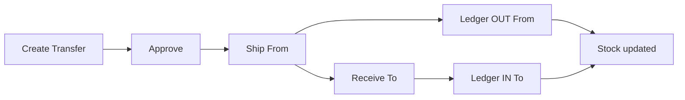
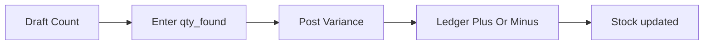
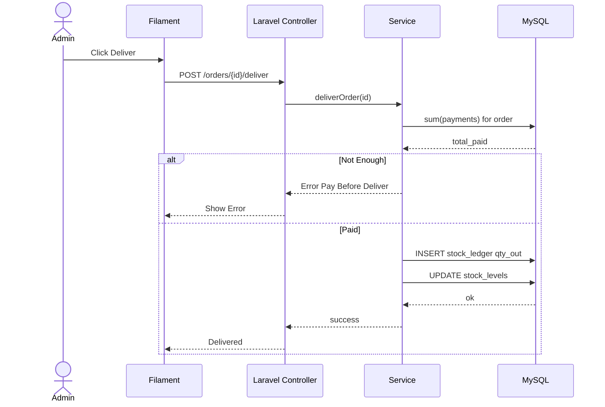

# ITC Stock Management System — Phase 2: System Design

> Tech: **Laravel 12 + Filament • MySQL • Spatie Roles + Policies • Single Filament Panel**  
> Scope anchors: **Branch-scoped • Stock Ledger as truth • No negative stock • Pay-before-Deliver**

---

## 1. Inputs (from Phase 1)
- Roles: **Super Admin**, **Admin (Branch Manager)**, **Distributor**  
- Modules: Branches, Users/Roles, Distributors, Products/Categories (global), Purchases (IN), Orders (OUT), Transfers, Stock Counts, Adjustments/Returns, Stock Ledger, Reports, Settings, Audit Log  
- Rules: Branch-scoped access, No Negative Stock, Pay-before-Deliver, Ledger append-only  
- Location master: **Provinces**, **Districts**

---

## 2. Entity List (Tables)
- **provinces**  
- **districts**  
- **branches**  
- **users** (+ Spatie tables)  
- **product_categories**  
- **products**  
- **distributors**  
- **suppliers** (for purchases)  
- **purchase_orders**, **purchase_items**  
- **sales_orders**, **order_items**  
- **payments**  
- **transfers**, **transfer_items**  
- **stock_counts**, **stock_count_items**  
- **stock_adjustments**  
- **stock_ledger** (append-only)  
- **stock_levels** (cache)  
- **audit_logs**  
- **settings**

---

## 3. Full ERD

> If ERD fails to render on GitHub, ensure the repository has Mermaid enabled (GitHub supports Mermaid in Markdown by default).

---

## 4. Table Sketches (Columns & Keys)
- **provinces**: id, name UNIQUE, code?, timestamps  
- **districts**: id, province_id(FK), name, code?, timestamps  
- **branches**: id, name, code UNIQUE, province_id?, district_id?, address?, is_active, timestamps  
- **users**: id, name, email, password, branch_id?(FK), phone?, timestamps  
- **product_categories**: id, name, slug, timestamps  
- **products**: id, sku UNIQUE, name, category_id?(FK), unit, base_price?, min_stock, is_active, timestamps  
- **distributors**: id, branch_id(FK), name, phone?, email?, province_id?, district_id?, address?, timestamps  
- **suppliers**: id, name, phone?, email?, address?, timestamps  
- **purchase_orders**: id, branch_id(FK), supplier_id(FK), po_no UNIQUE, status, totals, received_at?, notes?, timestamps  
- **purchase_items**: id, purchase_order_id(FK), product_id(FK), qty, unit_cost, line_total  
- **sales_orders**: id, branch_id(FK), customer_id?(FK distributors), so_no UNIQUE, status, payment_status, delivery_status, totals, confirmed_at?, fulfilled_at?, notes?, timestamps  
- **order_items**: id, sales_order_id(FK), product_id(FK), qty, unit_price, line_total  
- **payments**: id, order_type(sale|purchase), order_id, branch_id(FK), amount, method, paid_at, ref_no?, notes?  
- **transfers**: id, from_branch_id, to_branch_id, tr_no UNIQUE, status, shipped_at?, received_at?, notes?, timestamps  
- **transfer_items**: id, transfer_id(FK), product_id(FK), qty  
- **stock_counts**: id, branch_id(FK), count_no UNIQUE, status, counted_at?, notes?, timestamps  
- **stock_count_items**: id, stock_count_id(FK), product_id(FK), qty_found  
- **stock_adjustments**: id, branch_id(FK), product_id(FK), reason, qty_delta, notes?, approved_by?, adjusted_at, timestamps  
- **stock_ledger**: id, branch_id(FK), product_id(FK), ref_type, ref_id, qty_in, qty_out, unit_cost?, occurred_at, created_by?, notes?, timestamps  
- **stock_levels**: PK(branch_id, product_id), qty_current  
- **audit_logs**: id, actor_id(FK users), action, target_type, target_id, before_json?, after_json?, ip?, created_at  
- **settings**: key UNIQUE, value  

---

## 5. Invariants & Policies
- **No Negative Stock** → check before posting OUT ledger rows  
- **Pay-before-Deliver** → cannot deliver sales order until paid in full  
- **Branch Scoping** → all queries filtered by branch_id unless super_admin  
- **Ledger Immutable** → append-only; corrections via adjustments  
- **Transfers Double-Entry** → OUT from source branch, IN to target branch  

---

## 6. Core Flows (Activity Diagrams)

### Purchase IN

### Sales OUT Pay Before Deliver

### Transfer A To B

### Stock Count Variance

### Adjustment

---

## 7. Sequence: Pay Before Deliver

---

## 8. Migration Plan
1. provinces, districts  
2. branches, users (+Spatie)  
3. product_categories, products  
4. distributors, suppliers  
5. purchase_orders, purchase_items  
6. sales_orders, order_items  
7. transfers, transfer_items  
8. stock_counts, stock_count_items  
9. stock_adjustments  
10. payments  
11. stock_ledger, stock_levels  
12. audit_logs, settings  

---

## 9. Filament Resource Plan
- Branch (CRUD)  
- Product Category (CRUD)  
- Product (CRUD)  
- Distributor (CRUD)  
- Supplier (CRUD)  
- Purchase Order (Approve, Receive)  
- Sales Order (Confirm, Deliver)  
- Transfer (Approve, Ship, Receive)  
- Stock Count (Post Variance)  
- Stock Adjustment (Approve)  
- Stock Ledger (read-only)  
- Stock Levels (read-only)  
- Payments (link to orders)  
- Audit Log (read-only)  

---

## 10. Exit Checklist
- [x] Full ERD done  
- [x] Table sketches done  
- [x] Rules written  
- [x] Flows & sequence done  
- [x] Migration order finalized  
- [x] Filament plan ready  

**Phase 2 complete ✅**
